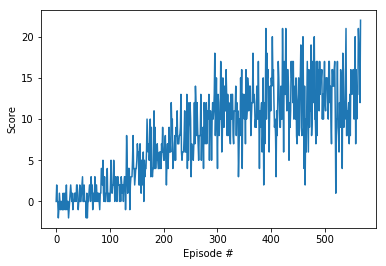

# Report

This project implements a reinforcement learning agent to navigate in a large, square world filled with yellow and blue bananas. For every yellow banana the agent collects it recieves a reward of +1 and -1 for every blue banana. The objective is to navigate around the space to collect all the yellow bananas and discard the blue ones. The environment is considered solved when the agent achieves an average score of +13  of +13 over 100 consecutive episodes.

The agents is trained using a Deep Q-Network (DQN) architecture based on the [Human-level control through deep reinforcement learning](https://www.nature.com/articles/nature14236)

## Implementation

The implementation split into a few smaller modules: 

* model.py - Neural Network model implemented with PyTorch
* dqn_agent.py - DQN agent implementation as described in [paper](https://www.nature.com/articles/nature14236) mentioned above
* Navigation.ipynb - imports all required modules and allows the enviroment to be explored and the agent trained
* Trained Navigation.ipynb - Runs an Agent using pre-trained weights from Navigation.ipynb

## Learning Algorithm

The agent in this project utilised the architecture for solving the DQN coding exercise as outlined in the [solution/Deep_Q_Network_Solution.ipynd solution](https://github.com/udacity/deep-reinforcement-learning/blob/master/dqn/solution/Deep_Q_Network_Solution.ipynb).	

The agent comprises of a pair of neural networks, the local and the target networks. Each network has the same architecture of 3 fully connected layers with ReLu activation on the first two layers. It also implements a replay buffer to store the experiences of an action in the enviroment, that is later sampled in batches to train the neural nets.

1. It starts by initializing the replay buffer and inital weights for the neural networks.
1. For each episode within the max_episodes given it:
	1. Resets Environment
	1. Gets current state from enviroment
	For each step in maximum number of timesteps per episode:
		1. Picks an action using state using an epslion-greedy algorithm
		1. Executes this action in the enviroments to obtain rewards, next_state, done
		1. Stores this experience in the replay buffer
		If timestep matches EVERY_UPDATE 
			1. Sample random batch of experiences from replay buffer
			1. Get predicted Q values from target network using next_states
			1. Compute target for current states using rewards + (gamma * Q_targets_next * (1 - dones))
			1. Get expected values from local model using states and actions
			1. Compute MSE Loss with expected values and target values
			1. Minimize loss using Adam Optimization, backprop and step
			1. Perform soft update of local network with target network and TAU value
	1. Keep looping until the average score over last 100 episodes >= 13
		1. Save weights of local network to file 

### Hyperparameter Tuning

The initial parameters were set to the same values as in [Deep_Q_Network_Solution.ipynb](https://github.com/udacity/deep-reinforcement-learning/blob/master/dqn/solution/Deep_Q_Network_Solution.ipynb)

	n_episodes=2000			# number of episodes		 
	max_t=1000 				# max number of timestep per episode
	eps_start=1.0			# starting epsilon value
	eps_end=0.01			# end epsilon value
	eps_decay=0.995 		# epsilon decay value
	BUFFER_SIZE = int(1e5)  # replay buffer size
	BATCH_SIZE = 64         # minibatch size
	GAMMA = 0.99            # discount factor
	TAU = 1e-3              # for soft update of target parameters
	LR = 5e-4               # learning rate 
	UPDATE_EVERY = 4        # how often to update the network

This leads to an agent that can achieve an average score of 13.06 after 467 episodes

By adjusting some of the hyperparameters the agent trained significantly faster.

	n_episodes=1000			# number of episodes		 
	max_t=10000 			# max number of timesteps per episode
	eps_start=0.5			# starting epsilon value
	eps_end=0.01			# end epsilon value
	eps_decay=0.98 			# epsilon decay value
	BUFFER_SIZE = int(1e6)  # replay buffer size
	BATCH_SIZE = 128        # minibatch size
	GAMMA = 0.99            # discount factor
	TAU = 1e-3              # for soft update of target parameters
	LR = 0.0001             # learning rate 
	UPDATE_EVERY = 2        # how often to update the network

The agent achieves a score of 13.01 after 163 episodes

By increasing the number of timesteps per episode it gave the agents a greater chance of obtaining a higher score per episode
Reducing the epsilon starting values to reduce the amount of time an agent picks moves at random initially
The BUFFER_SIZE and BATCH_SIZE were increased to allow the networks to train on more data quickly.
Also the learning rate and UPDATE_EVERY were decreased to allow faster learning now that there is more data to be trained on  

## Results

## Ideas for Future Work
---
* Implement improvements to DQN algorithm as suggested in  [Rainbow: Combining Improvements in Deep Reinforcement Learning] paper(https://arxiv.org/abs/1710.02298) [Github code](https://github.com/Kaixhin/Rainbow)
* Better tuning of hyperparameters, at present it was done in a very trial and error manner and better results may be achieved using something like XGBoost or possibly even [Particle Swarm Optimization](https://medium.com/next-level-german-engineering/hyperparameter-optimisation-utilising-a-particle-swarm-approach-5711957b3f3f)  
